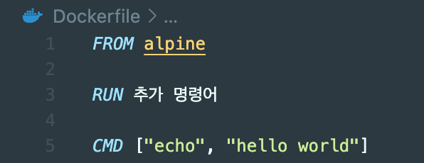
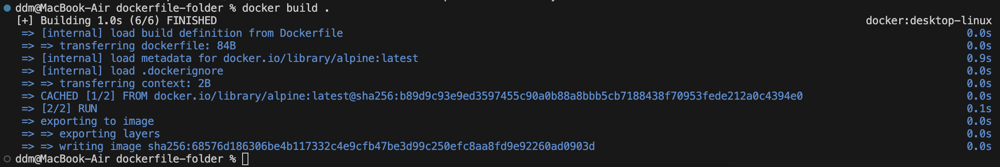
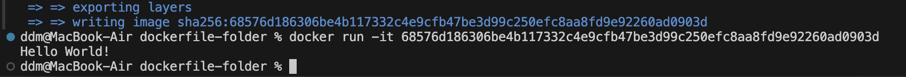
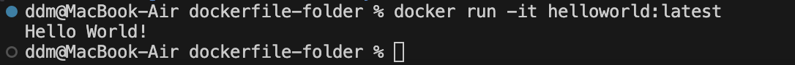

# 도커 이미지 생성해보기

<https://velog.io/@pinion7/%EB%8F%84%EC%BB%A4-%EC%9D%B4%EB%AF%B8%EC%A7%80-%EC%83%9D%EC%84%B1%ED%95%B4%EB%B3%B4%EA%B8%B0-feat.-Dockerfile>

## 실습 순서

### 1. 도커 파일을 만들 폴더 하나를 생성한다.
```bash
mkdir dockerfile-folder 
```
</br>

### 2. 도커 파일을 생성한다. 

```bash
touch Dockerfile
```



> * FROM
>   > 이미지 생성시 기반이 되는 이미지 레이어(베이스 이미지)를 넣는다. </br>
{이미지 이름} {태그} 형식으로 작성한다. </br>
태그는 버전이다. 태그를 안붙이면 자동적으로 가장 최신의 것으로 다운 받는다. </br>
> * RUN
>   > 도커 이미지가 생성되기 전에 수행되는 쉘 명령어이다. </br>
추가적으로 필요한 파일들을 다운로드 받는다. (없으면 주석 처리를 하면 된다.) </br>
> * CMD
>   > * 도커 컨테이너가 시작되었을 때 실행할 실행파일 혹은 쉘 스크립트이다.
>   > * 해당 명령어는 DockerFile 내에서 단 1회만 사용할 수 있다.

</br>

### 3. Dockerfile -> 도커 클라이언트 -> 도커 서버를 거쳐 이미지를 생성하도록 수행한다. 

```bash
docker build .
```


</br>

새로운 이미지 writing은 정상적으로 이루어졌고, 이미지 아이디 값도 sha256 옆에 생성이 되었다. </br>

### 4. 생성된 이미지를 실행하여 컨테이너를 생성함과 동시에 출력해보자.

```bash
docker run -it {이미지 아이디}
```



정상적으로 출력됨을 확인할 수 있다. </br>

## 3. Docker 이미지 생성시에 네이밍도 가능하다.

```bash
docker build -t helloworld:latest ./
docker run -it helloworld:latest
```

build 단계에서 추가적인 키워드를 사용해주면 된다. </br>
docker build -t {네이밍한 이미지 이름} . </br>

docker run -it {네이밍한 이미지 이름} </br>




</br></br>

## ( 참고 1) docker build ./ 를 통해 무슨일 일어나는 것일까?
1) 베이스 이미지를 다운로드 받는다.
2) 그리고 임시 컨테이너를 만든다.
3) 베이스 이미지에 들어있는 파일 스냅샷을 참고하여, 파일과 레이어들을 임시 컨테이너의 하드 디스크에 올린다.
4) 베이스 이미지에 있는 시작 명령어도 임시 컨테이너의 명령어 영역에 올린다.
5) 새로운 이미지를 만든다.
6) 임시 컨테이너에 들어온 명령어를 새로운 이미지의 시작명령어로 적용시킨다.
7) 동시에 임시 컨테이너에 들어온 파일 및 레이어들을 참고하여, 새로운 이미지의 파일 스냅샷으로 적용시킨다.
8) 최초에 받아온 베이스 이미지와 비슷하지만, 엄연히 다른 새로운 이미지가 생성되었다. (이미지 ID 값 다름)
9) 임시 컨테이너는 삭제된다.
(임시 컨테이너는 새로운 이미지를 만들기 위해, 그야말로 일시적으로 만들어진 컨테이너일 뿐인다.)
</br>

## (참고 2): 도커 이미지 네이밍 시에 효과적인 방법 혹은 규칙이 있을까?

* 기본 예시) docker build ./ </br>
* 네이밍 예시) docker build -t **dodookmung/helloworld:latest** ./ </br>
* 중간에 bold 효과가 들어간 부분만 새롭게 추가되었음을 알 수 있다. </br>
아래와 같은 규칙이 적용된 것이며, 이게 보편적이고 간편한 방식이라 할 수 있다. </br>
* **-t {나의 도커 아이디}/{저장소or프로젝트이름}:버전** </br>
* **-t**는 옵션을 주겠다는 명령어 이다. </br>
* 그 이후에는 굳이 설명하지 않아도 무엇이 들어가는 것인지를 이해할 수 있을 것이다. </br>
* {나의 도커 아이디}와 {저장소or프로젝트이름}는 사이는 /(슬래쉬)를 넣어서 구분한다. </br>
* {저장소or프로젝트이름}와 버전 사이는 :(콜론)을 넣어 구분한다. </br>