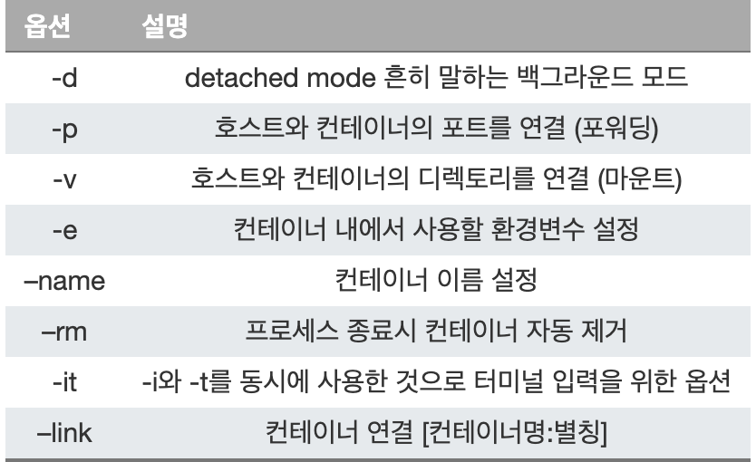

# Docker CLI Commands

<https://velog.io/@tastestar/Docker-Cli>

## 1. 도커 기본 명령어

#### run

```bash
docker run [OPTIONS] IMAGE[:TAGI@DIGEST] [COMMAND] [ARG...]
```

</br>

</br>

### ps

컨테이너 목록 확인</br>

```bash
docker ps [OPTIONS]
```

* -a </br>
맨 처음 실행했다가 종료된 컨테이너가 추가로 보입니다. (컨테이너는 종료되어도 삭제되지않고 남아있습니다.)

### stop

컨테이너 중지하기 </br>

```bash
docker stop [OPTIONS] CONTAINER [CONTAINER...]
```

### rm

종료된 컨테이너를 완전히 제거 </br>

```bash
docker rm [OPTIONS] CONTAINER [CONTAINER...]
```

예제</br>

```bash
$ docker ps
CONTAINER ID   IMAGE          COMMAND                  CREATED         STATUS         PORTS     NAMES
7eaad4047599   nginx:latest   "/docker-entrypoint.…"   5 minutes ago   Up 5 minutes   80/tcp    gracious_wozniak
fa730b536edc   nginx:latest   "/docker-entrypoint.…"   6 minutes ago   Up 6 minutes   80/tcp    nginx3
64526b142e50   nginx:latest   "/docker-entrypoint.…"   7 minutes ago   Up 7 minutes   80/tcp    nginx2

$ docker rm 7eaad4047599
```
</br>
</br>


* 중지된 컨테이너 ID 가져와서 한번에 삭제 </br>

```bash
docker rm -v $(docker ps -a -q -f status=exited)
```
</br>

### images

이미지 목록 확인하기 </br>

```bash
docker images [OPTIONS] [REPOSITORY[:TAG]]
```
</br>
이미지 주소와 태그, ID, 생성시점, 용량을 확인할 수 있습니다.
</br>

### pull

이미지 다운로드하기 </br>

```bash
docker pull [OPTIONS] NAME[:TAGI@DIGEST]
```

### rmi

이미지를 삭제합니다. </br>

```bash
docker rmi [OPTIONS] IMAGE [IMAGE...]
```
</br>
단 컨테이너가 실행중인 이미지는 삭제되지 않습니다.

### logs

컨테이너 로그보기 </br>

```bash
docker logs [OPTIONS] CONTAINER
```

### exec

실행중인 컨테이너에 들어가거나 컨테이너의 파일을 실행하고 싶을 때가 있습니다. </br>

```bash
docker exec [OPTIONS] CONTAINER COMMAND [ARG...]
```
</br>
run은 새로 컨테이너를 만들어서 실행하고 exec는 실행중인 컨테이너에 명령어로 실행합니다.


### ls

docker 상에서 작동하는 컨테이너 기동 상태를 확인합니다
</br>

```bash
docker container ls [OPTIONS]
```
</br>

```
- --all, -a : 실행 중/정지 중인 것도 포함하여 모든 컨테이너 표시
- --filter, -f : 표시할 컨테이너의 필터링
- --format : 표시 포맷을 지정
- --last, -n : 마지막으로 실행된 n건의 컨테이너만 표시
- --lastest, -l : 마지막으로 실행된 컨테이너만 표시
- --no-trunc : 정보를 생략하지 않고 표시
- --quiet, -q : 컨테이너 ID만 표시
- --size, -s : 파일 크기 표시
```
