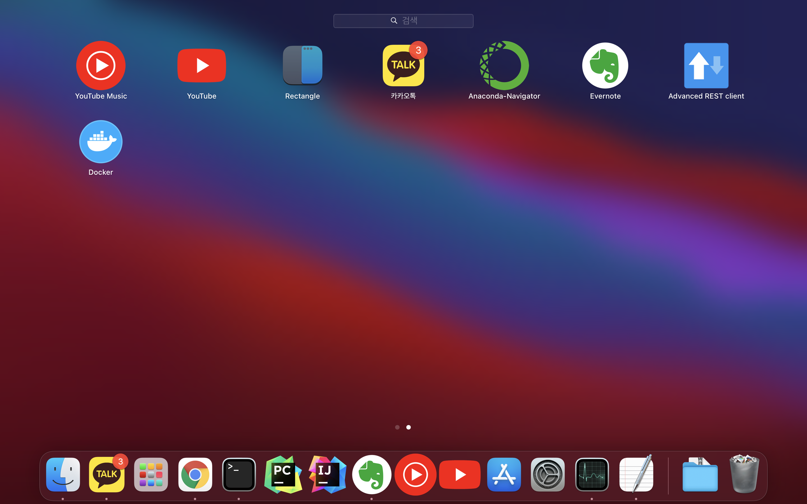

# Mac에서 Homebrew로 설치

cask 옵션을 주게 되면 Docker Desktop on Mac을 설치하게 되고 docker-compose, docker-machine을 같이 설치해주어 한결 편하게 사용할 수 있다.
</br>
### 설치
```bash
brew install --cask docker
```
명령어를 실행하면 Application에 docker가 생성된다.
</br>


### 버전 확인
```bash
docker --version
```

```bash
docker-compose --version
```