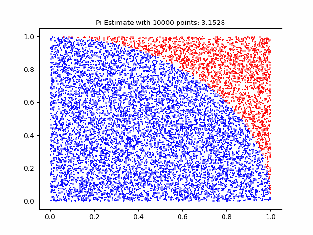
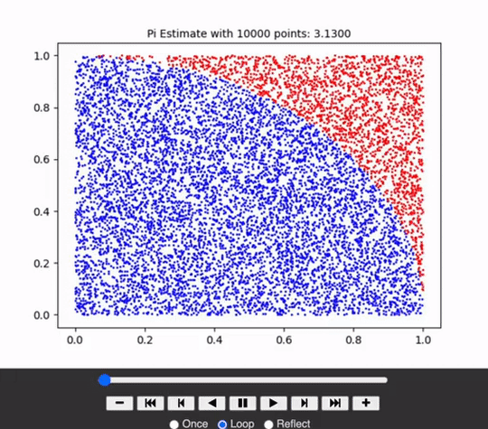

# 시각화

IPython 라이브러리를 활용하여 화면에 출력

HTML 표현은 Github에서 보이지 않기에, GIF 저장 후 마크다운에서 이미지로 표현해야 한다.
```python
import matplotlib.animation as animation

anim.save('Animation.gif', writer='imagemagick', fps=1, dpi=100)
```


- write parameter

```
PillowWriter: It relies on pillow library. It is preferred when you want to save the animation in gif format.

FFMpegWriter: pipe-based ffmpeg writer.

ImageMagickWriter: pipe-based animated gif.

AVConvWriter: pipe-based avconv writer.
```

<br>

HTML로 동영상 표현

```python
from IPython.display import HTML
import matplotlib.animation as animation

ani = animation.ArtistAnimation(fig, frames, interval=500, blit=True, repeat_delay=1000)

HTML(ani.to_jshtml())
```
