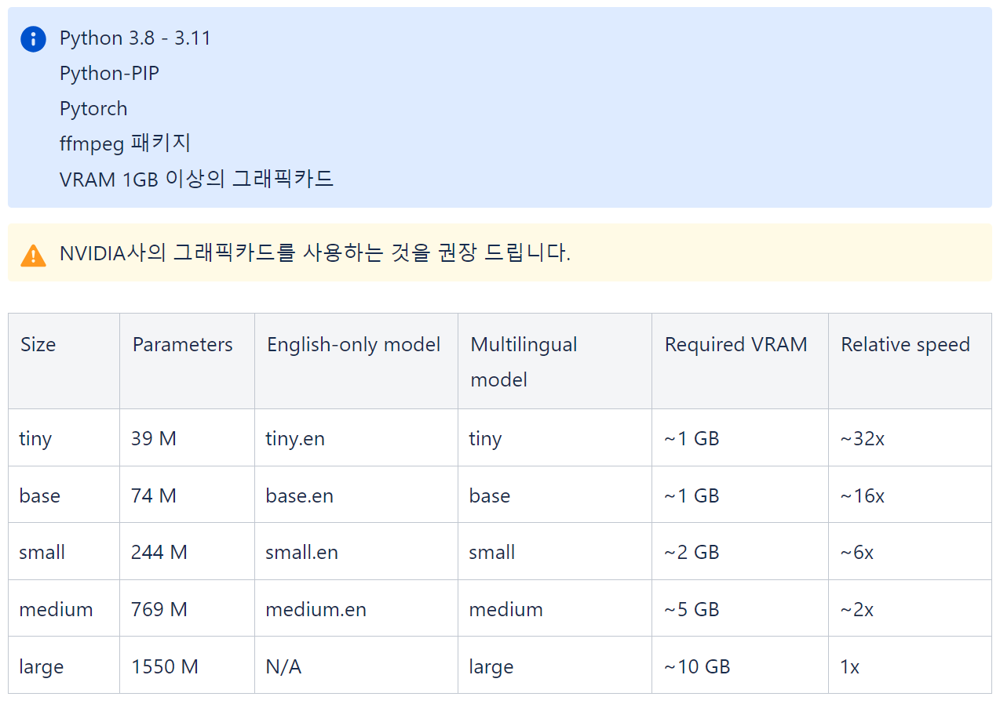

# OpenAI Whisper 설치 및 사용법

<https://tech.osci.kr/openai-whisper%EC%99%80-%ED%95%A8%EA%BB%98%ED%95%98%EB%8A%94-%EC%9D%8C%EC%84%B1-%EC%9D%B8%EC%8B%9D/>

## 요구 사항 및 설치



다양한 OS 환경에서 사용할 수 있으며 자세한 사항은 공식 Github를 참고해주세요. </br>
<https://github.com/openai/whisper>
</br></br>

1. Windows PowerShell 5.1 버전 이상에서 scoop을 설치합니다.

```bash
Set-ExecutionPolicy RemoteSigned -Scope CurrentUser
irm get.scoop.sh | iex
```
</br>

PyTorch 라이브러리가 없다면 설치해줍니다.</br>
```bash
pip install torch torchvision torchaudio --extra-index-url https://download.pytorch.org/whl/cu118
```
</br>

2. 아래 명령을 통해 Python을 통해 NVIDIA CUDA를 사용 가능한지 확인합니다.</br>
CPU를 통해 변환을 수행할 경우 GPU에 비해 현저히 낮은 처리 속도를 보여줍니다.</br>

```bash
python -c 'import torch; print(\"CUDA enabled:\", torch.cuda.is_available());'
```
</br>

### 올바른 결과

```bash
CUDA enabled: True
```
</br>

3. openai-whisper를 설치합니다.

```bash
pip install -U openai-whisper
```

4. ffmpeg 패키지를 설치합니다.

```bash
scoop install ffmpeg
pip install ffmpeg-python
```


## Whisper 사용해보기

본격적으로 Whisper를 사용해 보겠습니다. 변환 가능한 파일은 flac, mp3, wav 등의 오디오 파일 입니다.
만약, mp4와 같은 영상 파일은 mp3 파일로 먼저 변환이 필요합니다.</br>
</br>

첫 실행 시 모델의 다운로드를 진행하여 시간이 소요될 수 있으며, 오디오 파일의 크기에 따라 소요될 수 있는 시간이 다릅니다. model의 크기를 지정하지 않는다면 small 모델이 선택됩니다.</br>

```bash
whisper OMG.mp3 --language Korean --model medium
```
</br>
명령이 끝나면 실행한 디렉토리 위치에 json, srt, tsv, vtt, txt 다양한 형식으로 텍스트가 변환 되어 저장됩니다.</br>

원하는 형식만 저장하고 싶다면 아래와 같이 --output_format 옵션으로 지정해 사용가능 합니다.</br>

```bash
whisper OMG.mp3 --language Korean --model medium --output_format txt
```
</br>
</br>
</br>

## 다국어를 지원하는 Whisper

110개 언어가 지원되는 것으로 확인됩니다.</br>

Whisper 지원 언어</br>


Afrikaans, Albanian, Amharic, Arabic, Armenian, Assamese, Azerbaijani, Bashkir, Basque, Belarusian, Bengali, Bosnian, Breton, Bulgarian, Burmese, Castilian, Catalan, Chinese, Croatian, Czech, Danish, Dutch, English, Estonian, Faroese, Finnish, Flemish, French, Galician, Georgian, German, Greek, Gujarati, Haitian, Haitian Creole, Hausa, Hawaiian, Hebrew, Hindi, Hungarian, Icelandic, Indonesian, Italian, Japanese, Javanese, Kannada, Kazakh, Khmer, Korean, Lao, Latin, Latvian, Letzeburgesch, Lingala, Lithuanian, Luxembourgish, Macedonian, Malagasy, Malay, Malayalam, Maltese, Maori, Marathi, Moldavian, Moldovan, Mongolian, Myanmar, Nepali, Norwegian, Nynorsk, Occitan, Panjabi, Pashto, Persian, Polish, Portuguese, Punjabi, Pushto, Romanian, Russian, Sanskrit, Serbian, Shona, Sindhi, Sinhala, Sinhalese, Slovak, Slovenian, Somali, Spanish, Sundanese, Swahili, Swedish, Tagalog, Tajik, Tamil, Tatar, Telugu, Thai, Tibetan, Turkish, Turkmen, Ukrainian, Urdu, Uzbek, Valencian, Vietnamese, Welsh, Yiddish, Yoruba

</br>

