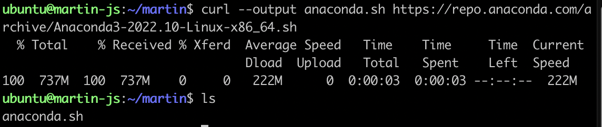
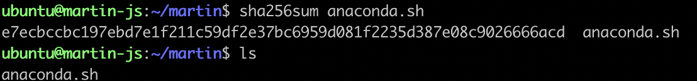
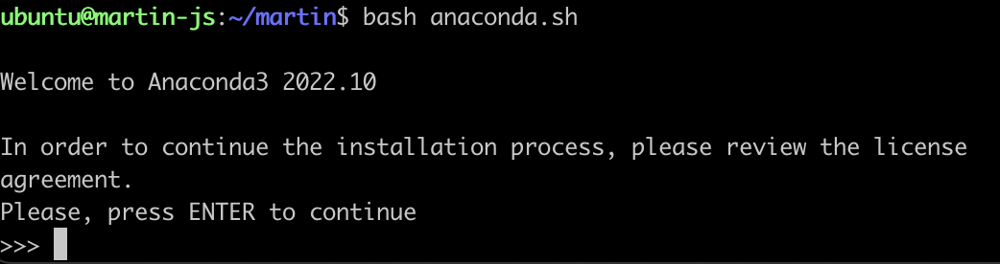
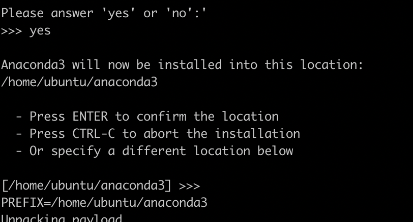
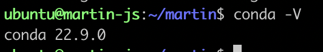

# Anaconda 설치 및 사용법

<https://jongsky.tistory.com/21>

<br>

## Ubuntu 22.04에 Anaconda 설치 방법

### 1단계: apt update
```bash
sudo apt update
```
### 2단계: curl 패키지 설치
```bash
sudo apt install curl -y
```
### 3단계: Anaconda 설치
```bash
curl --output anaconda.sh https://repo.anaconda.com/archive/Anaconda3-2022.10-Linux-x86_64.sh
```


다른 버전 설치를 원한다면 <https://repo.anaconda.com/archive/>

</br>

```bash
sha256sum anaconda.sh
```


무결성 체크

```bash
bash anaconda.sh
```



설치 실행

### 4단계: conda 명령어 환경변수 추가
```bash
sudo nano ~/.bashrc
```

</br>

```bash
export PATH=~/anaconda3/bin:~/anaconda3/condabin:$PATH
```
export PATH를 맨 마지막 줄에 추가 후, 저장

### 5단계: conda 잘 설치되었는지 확인
```bash
conda -V
```


### 6단계: 가상환경 설치 

```bash
conda create -n [가상환경 이름] python=[버전] 
```

( example )
```bash
conda create -n virtual_env python=3.6
```

</br>

### 7단계: 가상환경 실행

```bash
conda activate virtual_env
```

만약 IMPORTANT: You may need to close and restart your shell after running 'conda init'. </br>
과 같은 에러가 난다면</br>
profile 변경 값을 conda shell script 파일에 적용시킨다.

```bash
source ~/anaconda3/etc/profile.d/conda.sh
```

</br></br>

## Anaconda 자주 사용되는 명령어

### env 활성화, 비활성화
```bash
$ conda activate virtual_env
(virtual_env) $ conda deactivate
```

### env 리스트 확인
```bash
conda env list
```

### env 생성
```bash
conda create -n [가상환경 이름] python=[버전] 
```

### env 삭제
```bash
conda remove -n [가상환경 이름]
```
