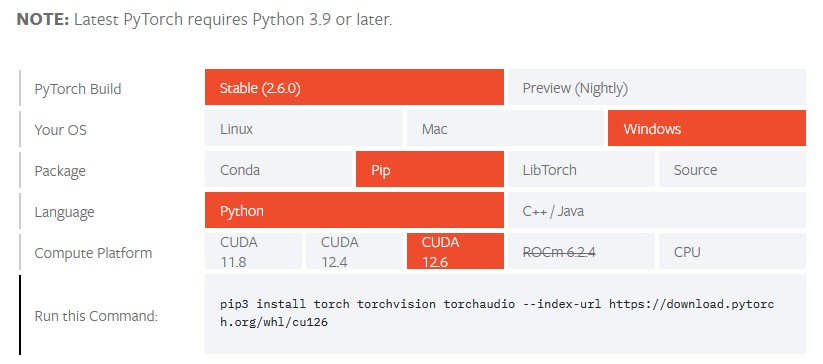
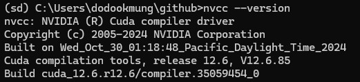
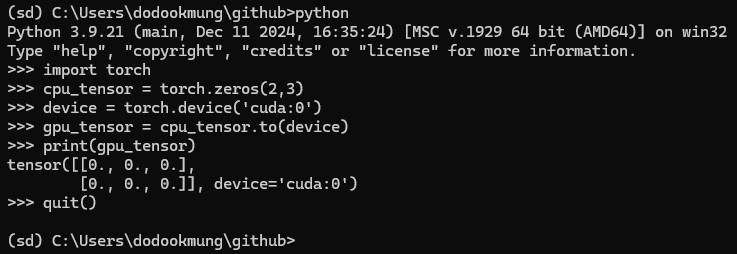

# CUDA 설정 가이드

pytorch와 tensorflow의 요구사항이 다르며 기타 패키지 충돌 위험이 있다. </br>
안정성을 위해 conda 가상환경에 생성하는 것을 권장한다.



pytorch 공식 문서에서 미리 버전별 요구 사항을 확인한다.</br>
(요구하는 python 버전도 자주 바뀌니 가상환경을 생성하기 전에 확인하자.)

</br>

## CUDA 설치 버전 확인
윈도우 명령 프롬프트에서 nvcc --version을 입력하면 설치된 cuda version 확인 가능

```bash
nvcc --version
```



현재 CUDA 12.6이 설치되어 있는 것을 확인할 수 있다. 



**.to(device)** 로 gpu에 텐서를 할당해보고 잘 작동하는지 확인한다.</br>
(cuda 설정이 제대로 되지 않아 에러가 난다면 처음부터 다시 해야한다.)

</br></br>

### Reference
https://velog.io/@ksy5098/CUDA-cuDNN-%EC%84%A4%EC%B9%98-%EB%B2%84%EC%A0%84-%ED%99%95%EC%9D%B8