# ml-agents 설치 가이드

<https://gdev.tistory.com/1>

## 유니티 ML연동과 Pretrained Model로 예제 실행

유니티 강화학습에 관련된 자료나 도서들이 이전 release 기술들로 설명하기 때문에,</br>
위 참조자료를 따라 구버전 release로 학습을 진행한다.</br>
</br>

먼저 유니티 2021.1.0f1 버전을 설치해 주어야 한다.

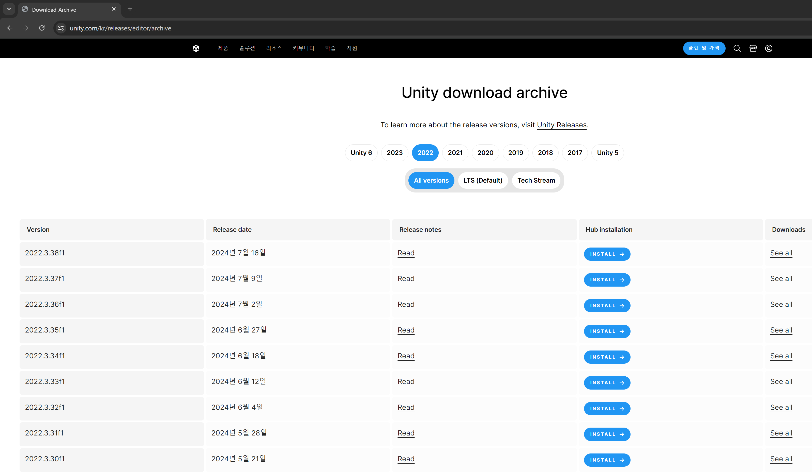

Unity Hub에 보이지 않는 과거 버전들은</br>
<https://unity.com/kr/releases/editor/archive> 에서 다운로드 할 수 있다.
</br>
</br>


<https://github.com/Unity-Technologies/ml-agents/blob/release_8_docs/docs/Readme.md>

자료 참조를 위해 docs를 열어놓고,
</br>

<https://github.com/Unity-Technologies/ml-agents/blob/release_8_docs/docs/Installation.md>

main branch 설치 링크는 사라졌기에, git으로 원하는 경로에 release_8 branch를 다운 받는다.
```bash
git clone --branch release_8 https://github.com/Unity-Technologies/ml-agents.git
```

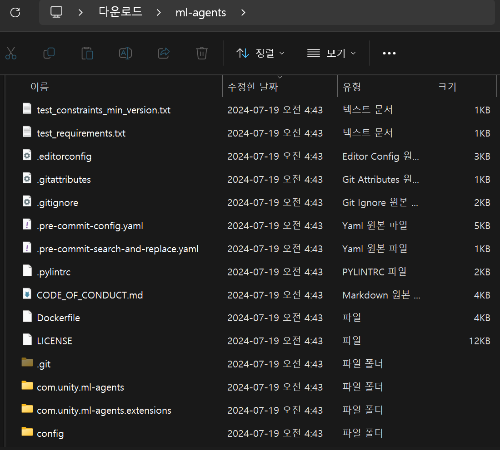

이런 파일 구성이다.

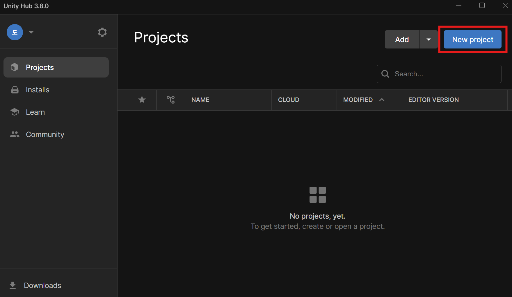

유니티 허브에서 프로젝트 새로 생성

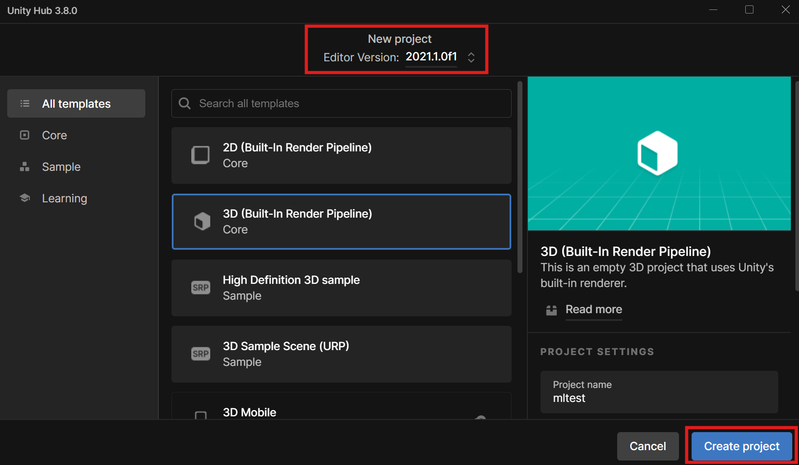

3D 프로젝트 생성

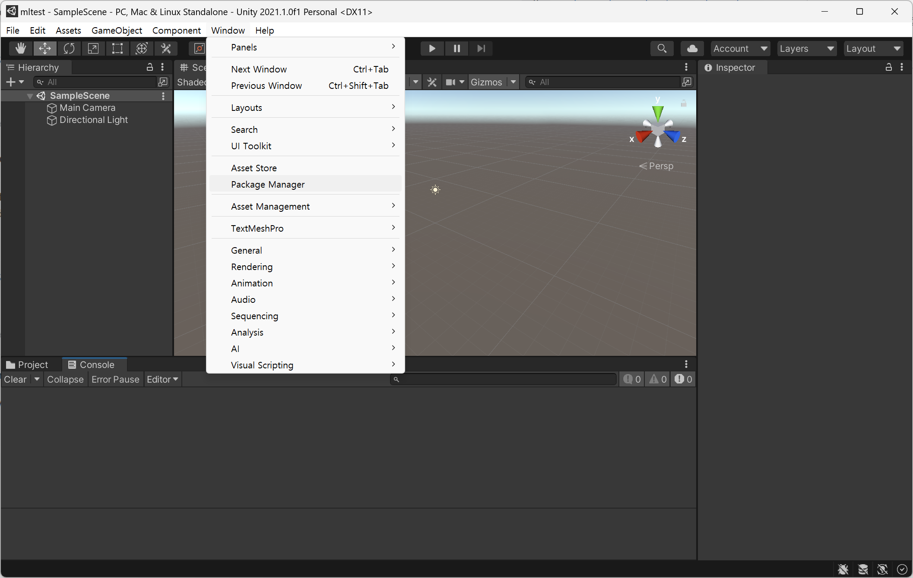

메뉴에서 Windows -> Package Manger

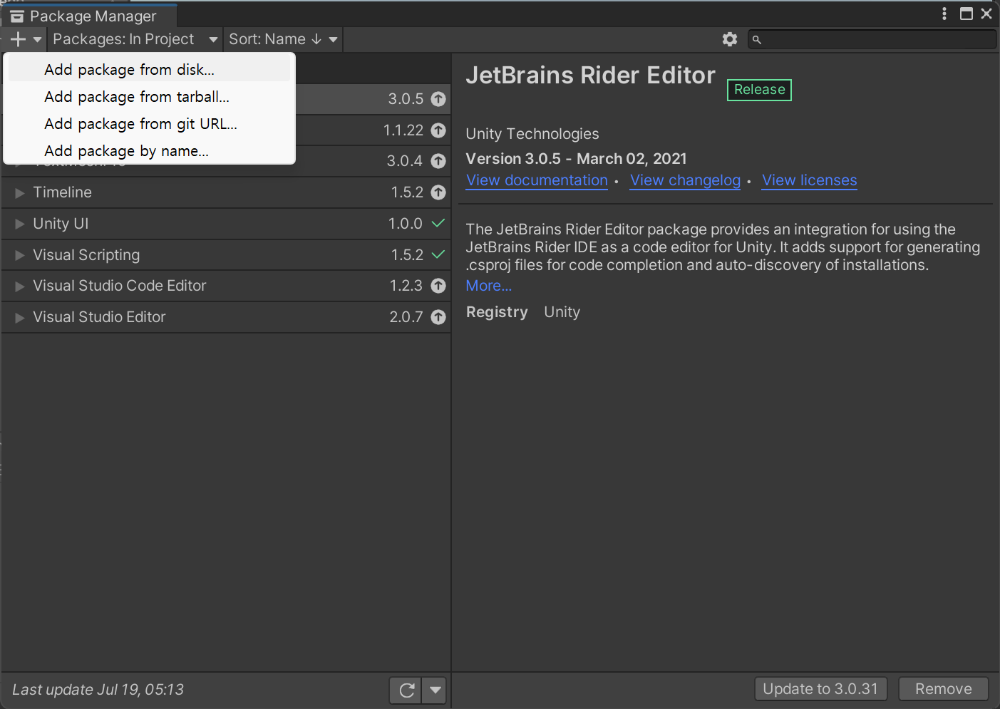

왼쪽 좌측 + 아이콘을 눌러준 후, add package from disk... 클릭

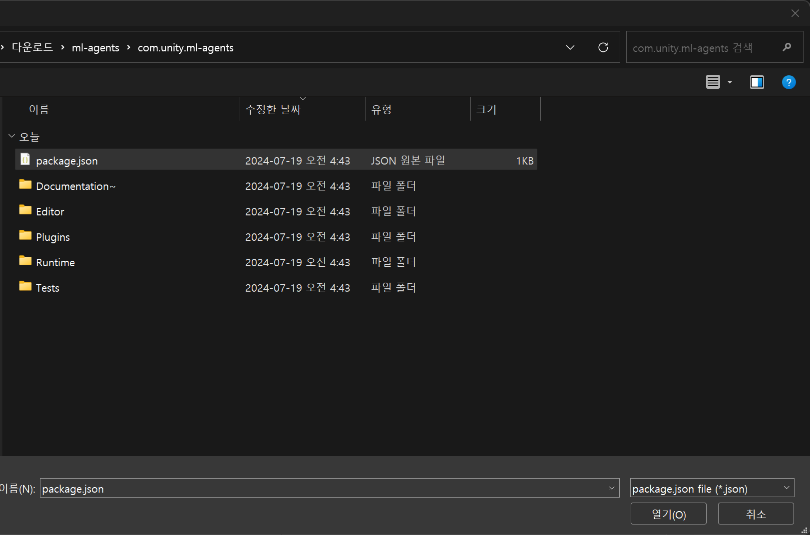

git으로 다운받은 자료에서 com.unity.ml-agents -> package를 선택

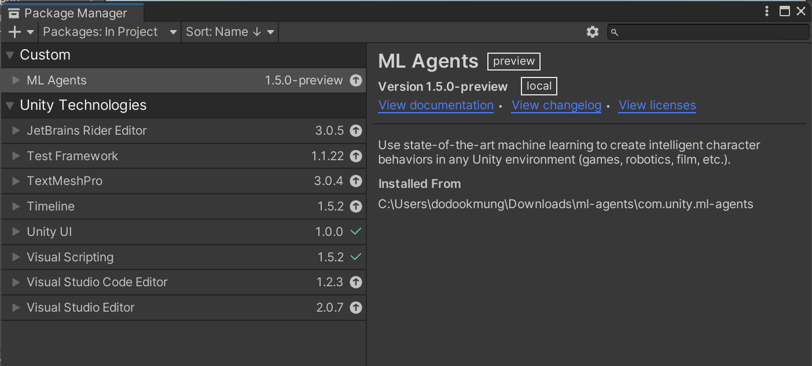

1.5 버전 설치 확인

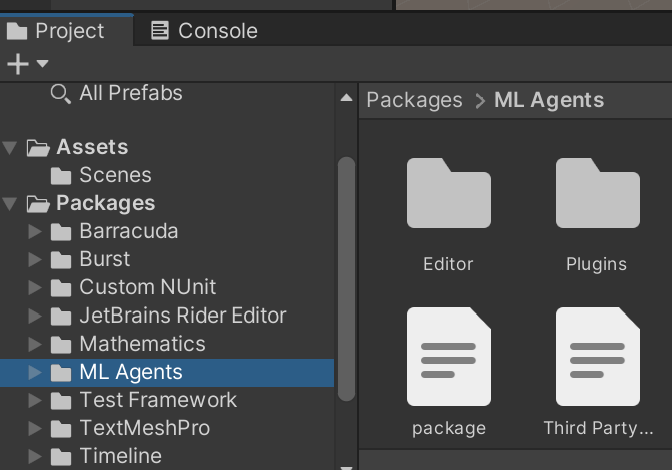

Project 창에서도 파일이 들어온걸 확인할 수 있다.</br>
현재까진 console에 에러가 없어야 한다.
</br>

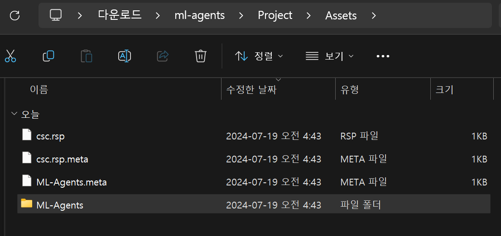

이 ML-Agents 파일을

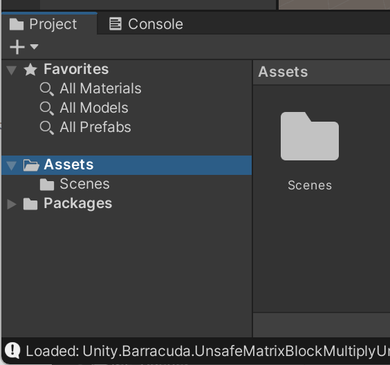

Assets로 드래그 앤 드랍 해준다.

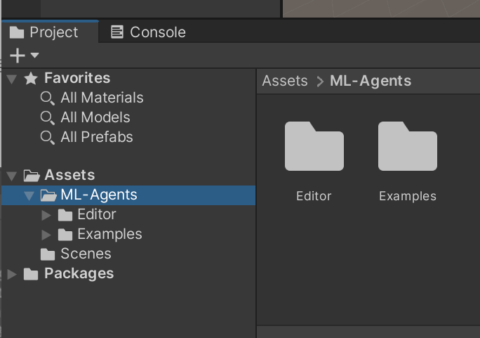

완료.</br>
여기까지 하면 기본 테스트 예제들을 돌려 볼 수 있다.


### PushBlock 예제 실행해 보기

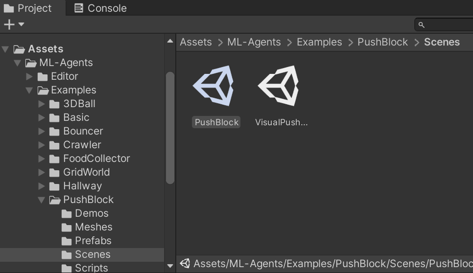

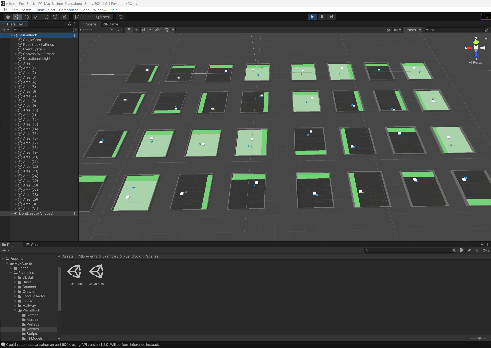

Pretrained 된 모델들이 잘 작동한다.
